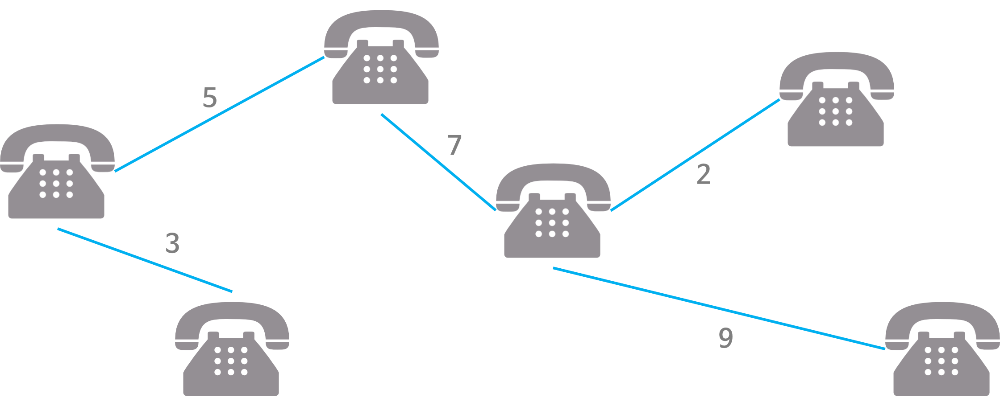

# Minimum Spanning Tree (MST, 최소 신장 트리)

## Spanning Tree

**그래프 내의 모든 정점을 포함하는 트리(==신장트리)로, 그래프의 초소 연결 부분 그래프이다.**

<ul>
  <li> 최소 연결 = 간선의 수가 가장 작다.</li>
  <li> n개의 정점을 가지는 그래프의 <b>최소 간선의 수는 n-1개</b> 이고 n-1개의 간선으로 연결되어 있으면 필연적으로 트리 형태가 되는데 이것이 Spanning Tree이다.</li>
</ul>

### Spanning Tree 의 특징

<ul>
  <li> 하나의 그래프에 많은 신장 트리가 존재할 수 있다.</li>
  <li> Spanning Tree는 트리의 특수한 형태이므로 <b>모든 정점들이 연결</b> 되어 있어야 하고 <b>사이클을 포함해서는 안된다</b></li>
</ul>

### Spannging Tree의 사용 사례
통신 네트워크 구축

<ul>
  <li>예를 들어, 회사 내의 모든 전화기를 가장 적은 수의 케이블을 사용하여 연결하고자 하는 경우 </li>
  <li>n개의 위치를 연결하는 통신 네트워크를 최소의 링크(간선)를 이용하여 구축하고자 하는 경우, 최소 링크의 수는 (n-1)개가 되고, 따라서 Spanning Tree가 가능해진다.</li>
</ul>

## MST란
**Spanning Tree 중에서 사용된 간선들의 가중치 합이 최소인 트리**
<ul>
  <li>
    각 간선의 가중치가 동일하지 않을 때 단순히 가장 적은 간선을 사용한다고 해서 최소 비용을 얻어지는 것은 아니다.
  </li>
  <li>
    MST는 간선에 가중치를 고려하여 최소 비용의 Spanning Tree를 선택하는 것을 말한다.
  </li>
  <li>
    즉, 네트워크(가중치를 간선에 할당한 그래프)에 있는 모든 정점들을 가장 적은 수의 간선과 비용으로 연결하는 것
  </li>
</ul>

### MST의 특징
<ol>
  <li>간선의 가중치의 합이 최소여야 한다.</li>
  <li>n개의 정점을 가지는 그래프에 대해 반드시 n-1개의 간선만을 사용해야 한다.</li>
  <li>사이클이 포함되어서는 안된다.</li>
</ol>

### MST 사용 사례
통신, 도로, 유통망 구축에서 최소 비용, 최소 시간으로 구축하려는 경우

<ul>
  <li>
    도로건설
    <ul> 
      <li>도시들을 모두 연결하면서 도로의 길이가 최소가 되도록 하는 문제</li>
    </ul>
  </li>
  <li>
    전기 회로
    <ul> 
      <li>단자들을 모두  연결하면서 전선의 길이가 가장 최소가 되도록 하는 문제</li>
    </ul>
  </li>
  <li>
    통신
    <ul> 
      <li>전화선의 길이가 최소가 되도록 전화 케이블 망을 구성하는 문제</li>
    </ul>
  </li>
  <li>
    배관
    <ul> 
      <li>파이프를 모두 연결하면서 파이프의 총 길이가 최소가 되도록 연결하는 문제</li>
    </ul>
  </li>
</ul>

## MST의 구현 방법
### 1. <a href="">Kruskal 알로리즘</a>

### 2. <a href="">Prim 알고리즘</a>

## References
<a href="https://gmlwjd9405.github.io/2018/08/28/algorithm-mst.html">Heee's Development Blog</a>
