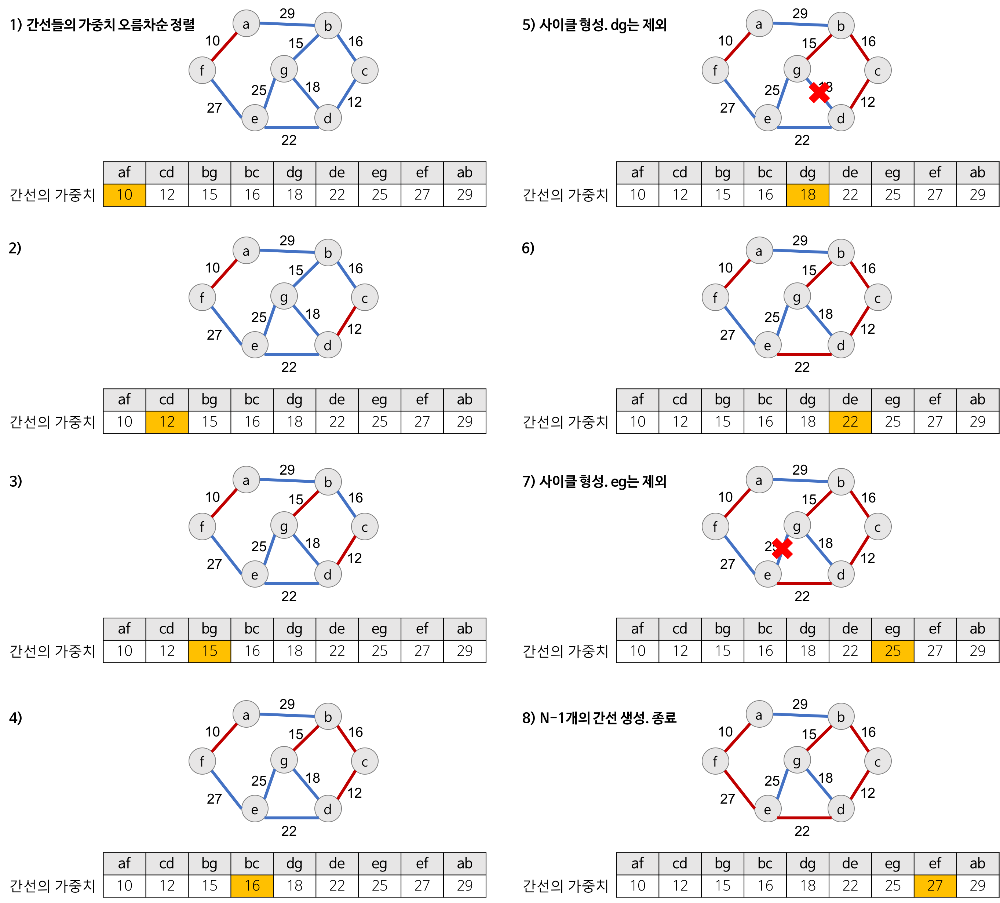

# Kruskal 알고리즘

**탐욕적인 방법(greedy method)** 을 이용하여 네트워크(가중치를 간선에 할당한 그래프)의 모든 장점을 최소 비용으로 연결하는 최적 해답을 구하는 것

#### 탐욕적인 방법
<ul>
  <li>결정을 해야 할 때마다 그 순간에 가장 좋다고 생각되는 것을 선택함으로써 최종적인 해답에 도달하는 것</li>
  <li>탐욕적인 방법은 그 순간에는 최적이지만, 전체적인 관점에서 최적이라는 보장이 없기 때문에 반드시 검증해야 한다.</li>
</ul>

MST(최소 비용 신장 트리)는
1. 최소 비용의 간선으로 구성됨 
2. 사이클을 포함하지 않음 의 조건에 근거하여 각 단계에서 사이클을 이루지 않는 최소 비용 간선을 선택 한다.

## Kruskal 알고리즘 동작

1. 그래프의 간선들을 가중치의 오름차순으로 정렬한다.
2. 정렬된 간선 리스트에서 순서대로 사이클을 형성하지 않는 간선을 선택한다.
    - 즉, 가장 낮은 가중치를 먼저 선택한다.
    - 사이클을 형성하는 간선을 제외한다.
3. 해당 간선을 현재의 MST(최소 비용 신장 트리)의 집합에 추가한다.

## Kruskal 알고리즘의 구체적인 동작 과정
Kruskal 알고리즘을 이용하여 MST를 만드는 과정

- **간선 선택을 기반**으로 하는 알고리즘
- 무조건 최소 간선만 선택하는 방법



**주의 사항**
- 다음 간선을 이미 선택된 간선들의 집합에 추가할 때 **사이클을 생성하는지를 체크
  - 새로운 간선이 이미 다른 경로에 의해 연결되어 있는 정점들을 연결할 때 사이클이 생성된다. 
  - 즉, 추가할 새로운 간선의 양끝 정점이 같은 집합에 속해 있으면 사이클이 생성된다.
- **사이클 생성 여부를 확인하는 법
  - 추가하고자 하는 간선의 양끝 정점이 같은 집합에 속해 있는지를 먼저 검사
  - **union-find 알고리즘**을 이용

## Kruskal 알고리즘 구현
**JAVA**
```java
import java.io.BufferedReader;
import java.io.InputStreamReader;
import java.io.FileReader;
import java.io.IOException;
import java.util.*;


public class Main {

    // Node 객체 클래스 정의
    // Comparable 인터페이스를 구현하여 Collections.sort()로 간선을 정렬할 수 있도록 하기
    static class Node implements Comparable<Node> {
        int from; //간선 시작 정점
        int to; //간선 끝 정점
        int cost; //간선의 가중치

        public Node(int from, int to, int cost){
            this.from = from;
            this.to = to;
            this.cost = cost;
        }

        @Override
        public int compareTo(Node o){
            return this.cost - o.cost; // 가중치 기준 오름 차순 정렬
        }

    }

    static int V, E; // V= 정점의 개수, E=간선의 개수
    static int[] parents; // union-find의 부모 배열
    static ArrayList<Node> nodeList; //간선 정보를 저장할 리스트

    public static void main(String[] args) throws IOException {
//        BufferedReader in = new BufferedReader(new FileReader("input.txt"));
        BufferedReader in = new BufferedReader(new InputStreamReader(System.in));
        StringTokenizer st = new StringTokenizer(in.readLine());

        V = Integer.parseInt(st.nextToken());
        E = Integer.parseInt(st.nextToken());

        parents = new int[V+1];
        nodeList = new ArrayList<>();

        for (int i = 0; i < E; i++) {
            st = new StringTokenizer(in.readLine());
            int from = Integer.parseInt(st.nextToken());
            int to = Integer.parseInt(st.nextToken());
            int cost = Integer.parseInt(st.nextToken());
            nodeList.add(new Node(from,to,cost)); // 간선 정보 저장하기
        }

        Collections.sort(nodeList); // 가중치를 기준으로 정렬


        make();

        int sum =0; // MST의 총 가충치
        int cnt =0; // 추가된 간선수

        for (Node n : nodeList) {
            if (union(n.from, n.to)){ //사이클이 발생하지 않으면
                sum += n.cost;
                cnt++;
                if (cnt == V-1 ) break;  // 간선 수가 정점 수 -1이면 종료
            }
        }

        System.out.println(sum);

    }

    // Union-Find: 초기화
    private static void make() {
        for (int i = 1; i <= V; i++) {
            parents[i] = i; // 자기 자신을 대표자로 설정
        }
    }

    // 정점의 최상위 대표자를 찾는 함수
    private static int findSet(int v){
        if (parents[v] == v) return v;

        return parents[v] = findSet(parents[v]);
    }

    // 두 집합을 병합하는 함수
    private static boolean union(int from, int to){
        int fromRoot = findSet(from); // from의 대표자
        int toRoot = findSet(to);     // to의 대표자

        if (fromRoot == toRoot) return false; //같은 집합이면 사이클 발생

        parents[toRoot] = fromRoot; // 병합: toRoot를 fromRoot 아래로 연결
        return true;

    }
}


```


## Kruskal 알고리즘 시간 복잡도

- **union-find 알고리즘**을 이용하념 Kruskal 알고리즘의 시간 복잡도는 간선들을 정렬하는 시간에 좌우된다.
- 즉, 간선 e개를 퀵 정렬과 같은 효율적인 알고리즘으로 정렬한다면 
  - Kruskal 알고리즘의 시간 복잡도는 O(eloge)이 된다.

- Prim의 알고리즘의 시간 복잡도는 O(n^2)이다 따라서
  - 그래프 내에 적은 숫자의 간선을 이용해 **희소 그래프(Sparse Graph)**의 경우 Kruskal 알고리즘이 적합
  - 그래프에 간선이 많이 존재하는 **밀집 그래프(Dense Graph)**의 경우 Prim 알고리즘이 적합하다.

## References
<a href="https://gmlwjd9405.github.io/2018/08/28/algorithm-mst.html">Heee's Development Blog</a>
