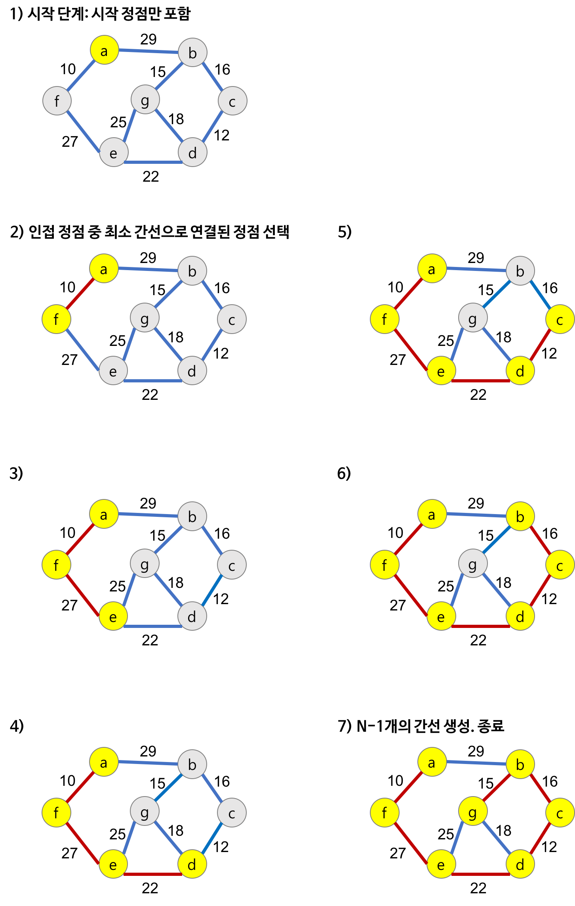

# Prim 알고리즘
시작 정점에서부터 출발하여 신장트리 집합을 단계적으로 확장해나가는 방법

## Prim 알고리즘의 동작
1. 시작 단계에서는 시작 정점만이 MST 집합에 포함됨
2. 앞 단계에서 만들어진 MST 집합에 인접한 정점들 중에서 최소 간선으로 연결된 정점을 선택하여 트리를 확정
3. 위의 과정을 트리가 N-1개의 간선을 가질 때 까지 반복

## Prim 알고리즘의 구체적인 동작 과정
Prim 알고리즘을 이용하여 MST를 만드는 과정

- 정점 선택을 기반으로 하는 알고리즘
- 이전 단계에서 만들어진 신장 트리를 확장하는 방법

## Prim 알고리즘의 시간 복잡도
- 주 반복문이 정점의 수 n 만큼 반복하고, 내부 반복문이 n번 반복
  - Prim의 알고리즘의 시간 복잡도는 O(n^2)이 된다.
- Kruskal 알고리즘의 시간 복잡도는 O(eloge)이므로
  - 그래프 내에 적은 숫자의 간선을 이용해 **희소 그래프(Sparse Graph)**의 경우 Kruskal 알고리즘이 적합
  - 그래프에 간선이 많이 존재하는 **밀집 그래프(Dense Graph)**의 경우 Prim 알고리즘이 적합하다.

## References
<a href="https://gmlwjd9405.github.io/2018/08/28/algorithm-mst.html">Heee's Development Blog</a>
