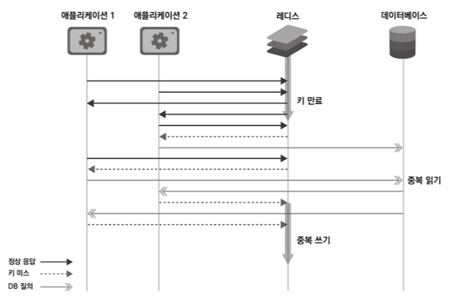

# 캐시 스탬피드 현상이 무엇이고 해결방안은 멀까요?

## 캐시 (Cache)란?
- 자주 사용하는 **데이터나 값을 미리 복사해 놓는 임시 장소**를 가리킨다. 아래와 같은 저장공간 계층 구조에서 확인할 수 있듯이, 캐시는 **저장 공간이 작고 비용이 비싼 대신 빠른 성능을 제공**한다. 

## 캐시 스탬피드 
- 캐시는 일반적으로 TTL(Time To Live)을 설정하는 경우가 많은데 만약 Data가 특정 시간에 한 번에 많이 캐싱되는 경우가 발생해(이벤트 or 설계 때문) 캐싱이 거의 동시에 이루어지고 TTL이 비슷하게 설정된다면 캐시된 데이터가 한번에 사라진다.
- 그 결과 캐시가 한 순간 대량 삭제와 대량 업데이트되는 현상이 반복 될 수 있는데 이걸 캐시가 우르르 몰려다닌다는 영어 뜻(stampede : 우르르 몰림)을 유래로 하여 캐시 스탬피드 현상이라고 한다.

1️⃣ 다수의 애플리케이션이 동일한 캐시 키를 요청
↓
2️⃣ 캐시가 만료(TTL 초과)되면서 데이터가 삭제됨
↓
3️⃣ 모든 요청이 동시에 DB로 쏠림 (Duplicate Read 발생)
↓
4️⃣ DB에서 데이터를 가져온 후 캐시에 다시 저장
↓
5️⃣ 여러 애플리케이션이 동시에 캐시에 데이터를 저장 (Duplicate Write 발생)

이 과정에서 **DB 부하가 급증**하고 **시스템 응답 시간이 느려지거나 장애가 발생**할 수 있다.

### 해결방안

#### 1️⃣ TTL 설정

1. 적절한 만료 시간 설정 - 만료 시간을 너무 짧지 않게 설정
2. 랜덤 TTL 적용 - TTL 값을 일정 범위 내에서 랜덤하게 설정하여 동일한 시간에 캐시가 만료되지 않도록 하기

#### 2️⃣ Lock
- Lock을 이용한 방법은 "한 번에 하나의 요청만 DB에서 데이터를 조회하고 캐시에 저장하도록 제어" 하는 방식
- Mutex Lock , Redisson 분산 락 (Advanced)이 있음

##### Mutex Lock (분산 락) 기본 개념
- 하나의 요청만 캐시를 갱신할 수 있도록 락(Lock)을 사용
- 단일 서버에서만 적용 가능한 락
- 첫 번째 요청이 캐시 갱신을 수행하는 동안 다른 요청은 캐시 갱신이 끝날 때까지 대기
- Redis에서 SETNX (SET if Not Exists) 또는 Redisson을 활용할 수 있음
장점
- 중복 읽기 방지: 한 번에 하나의 요청만 DB 조회
- 중복 쓰기 방지: 동일한 데이터를 여러 번 캐시에 저장하는 문제 해결
단점
- 락이 오래 유지되면 대기 시간이 증가할 수 있음
- 락이 만료되기 전에 예외가 발생하면 락이 풀리지 않는 문제 발생 가능
→ 이를 방지하려면 Redisson 분산 락을 사용하는 것이 좋음

##### Redisson 분산 락 (Advanced)
- Redisson을 활용한 분산 락 적용
- Redis에 자동 만료 기능이 있는 락을 설정하여 동시 접근 방지
- tryLock()을 사용하면 타임아웃이 설정된 락을 획득하는 동안 대기 가능
- 락을 획득하지 못한 요청은 캐시 데이터를 그대로 사용하여 DB 부하 방지
- 여러 서버에서도 동작 가능하여 MSA(마이크로서비스 아키텍처) 환경에서도 서버 간 락 공유 가능

#### 3️⃣ 주기적 갱신(선 계산)
- 캐시가 만료되기 전에 미리 데이터를 갱신(선계산)하는 기법
- 랜덤 값으로 TTL을 감소 시킨다음 TTL이 0이 되면 데이터를 다시 가져와 캐시에 저장하고 0 > 0 그대로 저장한 값 사용
🚨이때, 적절한 expiry_gap 설정이 중요하다

#### 4️⃣ PER(Probabilistic Early Refresh) 알고리즘
- 캐시 스탬피드현상을 방지하기 위해 캐시가 만료되기 전에 확률적으로 데이터를 갱신하는 기법
- 캐시가 만료되기 직전에만 데이터를 갱신하는 것이 아니라, 만료 시간이 가까워질수록 점진적으로 갱신 확률을 높여 DB 부하를 분산하는 방식이다.

https://inpa.tistory.com/entry/REDIS-%F0%9F%93%9A-%EC%BA%90%EC%8B%9CCache-%EC%84%A4%EA%B3%84-%EC%A0%84%EB%9E%B5-%EC%A7%80%EC%B9%A8-%EC%B4%9D%EC%A0%95%EB%A6%AC