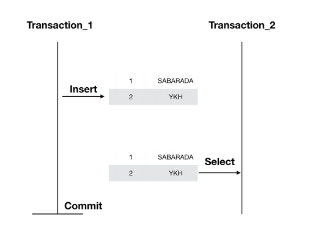

# 트랜잭션의 격리성

## 트랜잭션(Transaction)
- 데이터베이스의 상태를 변화시키기 해서 수행하는 작업의 단위
- DB에서는 일반적으로 All Or Nothing 전략을 사용하고 있음

### 트랜잭션의 4가지 특징
#### 원자성(Atomicity)
- 트랜잭션은 더 이상 분해가 불가능한 업무의 최소단위이므로, 전부 처리되거나 아예 하나도 처리되지 않아야 한다.
#### 일관성(Consistency)
- 일관된 상태의 데이터베이스에서 하나의 트랜잭션을 성공적으로 완료하고 나면 그 데이터베이스는 여전히 일관된 상태여야 한다. 즉, 트랜잭션 실행의 결과로 데이터베이스 상태가 모순되지 않아야 한다.
#### 격리성(Isolation)
- 실행 중인 트랜잭션의 중간결과를 다른 트랜잭션이 접근할 수 없다.
#### 영속성(Durability)
- 트랜잭션이 일단 그 실행을 성공적으로 완료하면 그 결과는 데이터베이스에 영속적으로 저장된다.

**트랜잭션의 정의를 보면 실행 중인 트랜잭션의 중간 결과를 다른 트랜잭션이 접근할 수 없다고 했는데 이건 DB 설정을 어떻게 하냐에 따라 다를 수 있다.**

### 격리성으로 인해 나타날 수 있는 문제점

**Dirty Read, Non-Repeatable Read, Phantom Read** 3가지가 일반적임

#### Dirty Read
- Dirty Read는 다른 트랜잭션에 의해 수정됐지만 아직 커밋되지 않은 데이터를 읽는 것을
- 이런 경우 Transaction_1이 정상처리되지 않고 Rollback될 수 있는데 그 값을 이미 읽은 Transaction_2는 잘못된 값을 가지고 본인의 로직을 처리하는 상태

#### Non-Repeatable Read
Non-Repeatable Read는 한 트랜잭션 내에서 같은 Key를 가진 Row를 두 번 읽었는데 그 사이에 값이 **변경**되거나 삭제되어 결과가 다르게 나타나는 현상

#### Phantom Read
한 트랜잭션 내에서 같은 쿼리를 두 번 수행했는데, 첫 번째 쿼리에서 없던 유령(Phantom) 레코드가 두 번째 쿼리에서 나타나는 현상을 말합니다.

### 지정할 수 있는 격리성 수준

#### Read Uncommitted
트랜잭션에서 처리 중인 아직 커밋되지 않은 데이터를 다른 트랜잭션이 읽는 것을 허용합니다. 해당 수준에서는 Dirty Read, Non-Repeatable Read, Phantom Read가 일어날 수 있습니다. 이 설정은 정합성에 문제가 있기 때문에 권장하는 설정은 아닙니다.

#### Read Committed
- 트랜잭션이 커밋되어 확정된 데이터만 다른 트랜잭션이 읽도록 허용합니다. 따라서 Dirty Read의 발생가능성을 막습니다. 커밋 되지 않은 데이터에 대해서는 실제 DB 데이터가 아닌 Undo 로그에 있는 이전 데이터를 가져오는 것입니다. 
- 하지만 Non-Repeatable Read와 Phanton Read에 대해서는 발생 가능성이 있습니다.

#### Repeatable Read
- 트랜잭션내에서 삭제, 변경에 대해서 Undo 로그에 넣어두고 앞서 발생한 트랜잭션에 대해서는 실제 데이터가 아닌 Undo 로그에 있는 백업데이터를 읽게 합니다. 
- 이렇게 함으로써 트랜잭션 중 값의 변경에 대해서 일정한 값으로 처리할 수 있습니다. 이렇게하면 삭제와 수정에 대해서 트랜잭션내에서 불일치를 가져오던 Non-Reapeatable Read를 해소할 수 있습니다.

#### Serializable Read
- 트랜잭션 내에서 쿼리를 두 번 이상 수행할 때, 첫 번째 쿼리에 있던 레코드가 사라지거나 값이 바뀌지 않음은 물론 새로운 레코드가 나타나지도 않도록 하는 설정입니다.

**Commit**
- Commit은 트랜잭션의 작업을 최종적으로 데이터베이스에 반영하는 과정을 의미합니다. 트랜잭션에 포함된 논리 작업 단위를 성공적으로 수행되었고, 데이터가 무결성을 준수한다면 Commit을 통해 데이터베이스에 반영

**Undo**
Undo 로그는 데이터베이스 트랜잭션에서 이전 상태로 되돌릴 수 있도록 기록해 두는 변경 전 데이터

### 실무에서 자주 사용하는 격리 수준은?
대부분의 DB (Oracle, PostgreSQL, MySQL 등)에서는 기본적으로 Read Committed 또는 Repeatable Read를 사용. 실시간 데이터 일관성이 중요한 경우에는 Serializable이 필요할 수 있지만, 성능 이슈로 잘 사용하진 않음

