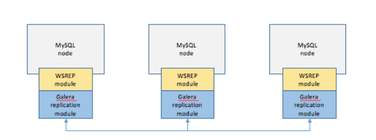
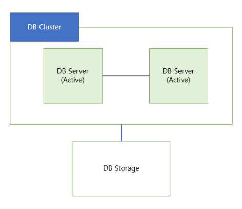
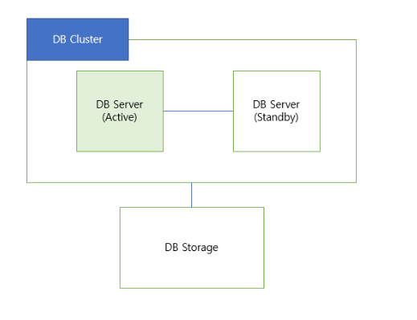

# 💡 Clustering (클러스터링)
- **여러 개의 DB를 수평적인 구조로 구축하는 방식** 
- 클러스터링은 분산 환경을 구성하여 Single point of failure와 같은 문제를 해결할 수 있는 **Fail Over 시스템을 구축하기 위해서** 사용된다. 
- 클러스터링은 **동기 방식으로 노드들 간의 데이터를 동기화**하는데, 자세한 처리 방법은 아래와 같다. 

## 📌 클러스터링 (Clustering) 처리 방식
### MySQL의 Clustering 방식 중 Galera 방식

1. 1개의 노드에 쓰기 트랜잭션이 수행되고, COMMIT을 실행한다.
2. 실제 디스크에 내용을 쓰기 전에 다른 노드로 데이터의 복제를 요청한다.
3. 다른 노드에서 복제 요청을 수락했다는 신호(OK)를 보내고, 디스크에 쓰기를 시작한다.
4. 다른 노드로부터 신호(OK)를 받으면 실제 디스크에 데이터를 저장한다.

- DB들 간의 데이터 무결성 검사(데이터가 일치하는지)를 하는 동기방식으로 데이터를 동기화한다. 
- 이러한 구조에 의해 클러스터링 방식은 다음과 같은 장점과 단점을 갖고 있다.

### ✅ 장점 
1. 노드들 간의 데이터를 동기화하여 항상 일관성있는 데이터를 얻을 수 있다.
2. 1개의 노드가 죽어도 다른 노드가 살아 있어 시스템을 계속 장애없이 운영할 수 있다.
3. 부하를 여러대로 분산시키는 로드벨런싱(load balancing)을 통한 속도 개선으로 더 많은 사용자의 요청에 대한 수용능력의 증가로 DB속도 개선에 영향을 준다

### ✅ 단점 (방법에 따라 다를 수 있음)
1. 여러 노드들 간의 데이터를 동기화하는 시간이 필요하므로 Replication에 비해 쓰기 성능이 떨어진다.
2. 장애가 전파된 경우 처리가 까다로우며, 데이터 동기화에 의해 스케일링에 한계가 있다.

 

### ✅ Clustering 구현 방식
- 클러스터링을 구현하는 방법으로는 또 **Active-Active**와 **Active-Standby**가 있다. 
- Active-Active는 클러스터를 항상 가동하여 가용가능한 상태로 두는 구성 방식이고, Active-Standby는 일부 클러스터는 가동하고, 일부 클러스터는 대기 상태로 구성하는 방식이다. 상황에 따라 알맞은 구조를 선택하면 된다.

#### 🔧 Active - Activate Clustering

#### 장점

1. 서버 하나가 죽어도 다른 서버가 역할을 바로 수행하여 중단되는 시간이 없다.
2. 같이 사용되어 CPU와 메모리 이용률을 늘릴 수 있다.

#### 단점

1. 저장소 하나를 공유하면 병복현상이 발생될 수 있다.
2. 병목현상 : 전체 시스템이 성능이나 용량이 하나의 구성요소로 인해 제한을 받는 현상이다.
3. 두 대의 서버를 동시에 운용해야하기 때문에 비용이 많이 든다.

#### 🔧 Active - StandBy Clustering

#### 장점
1. Active-Active 클러스터링에 비해 적은 비용이 든다.

#### 단점
1. 서버가 다운되었을 경우 다른 서버가 Active로 전환되는데 시간이 들어서 서버가 중단되는 시간이 존재한다.

### 🔥 동기식 복제(Synchronous Replication)
"데이터 일관성을 최우선으로 고려하는 방식"
Primary(마스터) 노드에서 트랜잭션이 커밋되기 전에, Standby(리플리카) 노드가 WAL 로그를 적용할 때까지 기다림.

### 출처

<a href="https://velog.io/@kwontae1313/DB-%ED%81%B4%EB%9F%AC%EC%8A%A4%ED%84%B0%EB%A7%81DB-Clustering%EC%9D%B4%EB%9E%80">DB-클러스터링이란?</a>

