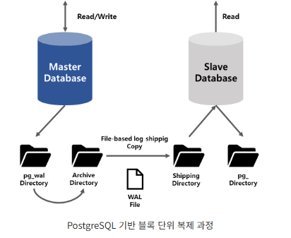
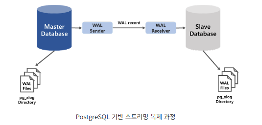
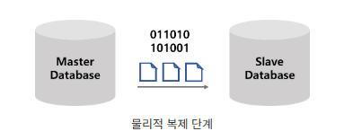
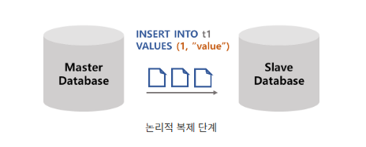
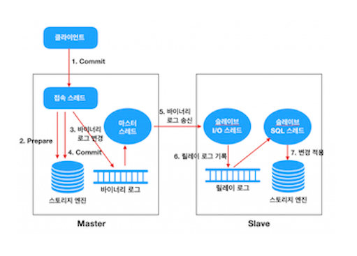
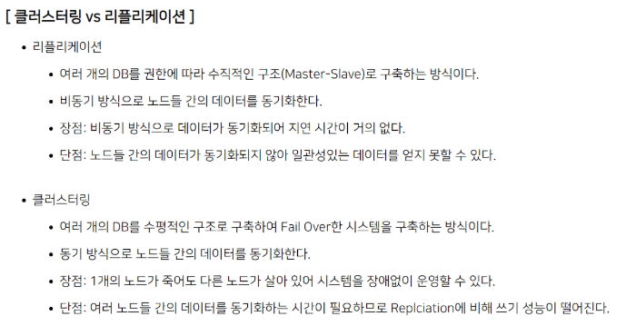

# 💡 Replication
- 두 개 이상의 DBMS 이용하여 Master/Slave (수직적)구조를 활용하여 DB의 부하를 분산 시키는 기술
- 데이터베이스 시스템에서 발생한 데이터의 **변경 사항**을 여러 대의 서버에 동일하게 복제하여 데이터 손실을 방지하고, 

## 📌 특징
- 데이터의 복제를 통해 데이터베이스의 가용성과 안정성을 높일 수 있음
- Master DB에는 Insert, Update, Delete 작업을 수행하도록 하고 Select 작업을 Slave DB에서 하도록 구성 
- 백업본을 활용하는 방식을 사용했을 때의 단점을 극복할 수 있음
    - 백업된 시간과 장애가 발생한 시간 사이의 데이터 변경 사항들은 모두 소실

- 원본의 서버 : Master / Primary / Leader 
- 복제된 서버 : Slave / Secondary / Replica 등으로 불림. 복제된 서버는 한대 이상의 서버가 있을 수 있다다.

### 장점 
1. Leader 데이터베이스에 장애가 발생할 경우 Replica를 Leader로 승격시켜 빠른 서비스 복구가 가능하다
2. 장애 복구 시 데이터 소실이 최소화
3. select 성능 향상 (읽기)

### 단점 (방법에 따라 다를 수 있음)
1. 서버가 다르기 때문에 동기화에 대한 어려움이 있다.
2. 데이터 정합성을 보장할 수 없음 (처리량을 따라가지 못하면)
3. Binary Log File 관리
    - Master는 Slave까지 관리 않기 때문에 Master에서 Binary Log File을 삭제 했다고 Slave에서 Binary Log를 삭제하지 못합니다.
3. Fail Over 불가
    - master에서 Error가 발생 했을 경우 Slave로 Failover하는 기능을 지원하지 않느다. Slave 역시 Master와 Log 위치가 다르다면 관리자가 작업을 해야 함.

 

## 📌 Replication의 분류 기준
Replication(복제)은 크게 두 가지 기준으로 분류할 수 있다다.
- 동기성 기준(Synchronous vs. Asynchronous)
- 복제 방식 기준(Physical vs. Logical)

 

## ✅ 1. 동기성 기준(Synchronous vs. Asynchronous)
데이터베이스에서 데이터를 복제하는 방식은 크게 동기 방식과 비동기 방식이 있다. 

- **동기 방식** : Master 노드에 데이터 변경이 발생할 경우 Slave 노드까지 (동시에) 적용되는 것을 보장하는 방식이며, 
- **비동기 방식** : Master 노드의 변경과 Slave 노드로의 적용이 시차를 두고 동기화되는 방식을 말한다.

### 🔥 동기식 복제(Synchronous Replication)
"데이터 일관성을 최우선으로 고려하는 방식"
Primary(마스터) 노드에서 트랜잭션이 커밋되기 전에, Standby(리플리카) 노드가 WAL 로그를 적용할 때까지 기다림.

#### 🔹 특징
- 데이터 무결성이 보장됨: Primary와 Standby의 데이터가 항상 동일하게 유지됨.
- 트랜잭션 커밋 속도가 느려질 수 있음: Primary가 Standby가 응답할 때까지 기다려야 함.
- Standby 노드가 죽으면 Primary도 영향을 받을 수 있음: Standby 노드가 응답하지 않으면 Primary의 성능이 떨어질 수도 있음.

#### 🔹 사용 사례
- 금융 시스템: 은행 트랜잭션 같은 경우, 데이터 손실이 절대 발생하면 안 됨.
- 미션 크리티컬 시스템: 실시간 데이터 일관성이 중요한 경우 (예: 병원 시스템).
- 재해 복구(DR, Disaster Recovery) 시스템: 항상 최신 상태의 Standby를 유지해야 하는 경우.

#### 🔹 단점
- 네트워크 부하 증가: Primary가 Standby의 응답을 기다려야 하기 때문에 성능 저하 발생 가능.
- 성능 저하: Standby 노드가 느려지면 Primary의 성능도 같이 떨어짐.
- 장애 발생 시 가용성 저하 가능성: Standby가 응답하지 않으면 Primary에서 트랜잭션이 지연될 수 있음.

### 🔥 비동기식 복제(Asynchronous Replication)
"성능을 우선으로 고려하는 방식"
Primary 노드는 트랜잭션을 커밋한 후, 즉시 응답을 반환하고 Standby 노드에는 WAL 로그를 비동기적으로 보냄.

#### 🔹 특징
- 트랜잭션 속도가 빠름: Primary가 Standby의 응답을 기다리지 않으므로 성능이 더 좋음.
- 데이터 복제 지연(Lag)이 발생할 수 있음: Primary에서 커밋된 데이터가 Standby에 적용되는 시간이 지연될 수 있음.
- 일부 데이터 손실 가능성 존재: Primary가 장애가 발생하면 Standby에 아직 반영되지 않은 트랜잭션이 유실될 수 있음.

#### 🔹 사용 사례
- 웹 애플리케이션 및 일반 서비스: 트랜잭션 속도가 중요하고 약간의 데이터 손실이 허용될 수 있는 경우.
- 읽기 부하 분산(Read Replicas): 대규모 조회(Read)를 위한 다중 Standby 운영.
- 대규모 데이터 처리 환경: 실시간성이 요구되지 않는 분석 시스템.

#### 🔹 단점
- 데이터 불일치 가능성: Primary와 Standby가 100% 동일한 데이터를 가지지 않을 수 있음.
- 복제 지연 문제: Primary에서 발생한 변경 사항이 Standby에 즉시 반영되지 않을 수도 있음.
- Failover 시 유실 위험: Primary가 다운되면 마지막 몇 개의 트랜잭션이 Standby에 복제되지 않고 손실될 가능성이 있음.

### 🚀보통 비동기식 복제가 더 많이 사용됨! 🚀

- 성능이 더 뛰어남 → Primary가 Standby의 응답을 기다릴 필요가 없으므로 TPS(Transactions per Second)가 더 높음.
- 대부분의 애플리케이션에서는 약간의 데이터 손실이 감수 가능 → 예를 들어 쇼핑몰, SNS 서비스에서는 아주 작은 손실이 발생하더라도 큰 문제가 되지 않음.
- 읽기 부하 분산이 가능함 → 읽기 전용 쿼리를 Standby에서 실행하면서 성능 최적화 가능.
- Failover가 더 빠름 → Standby를 Primary로 전환할 때 동기 복제보다는 빠르게 진행됨.

#### ✅ 그러면 동기식 복제는 언제 쓰나?
- 은행, 증권 거래소, 의료 시스템 등 데이터 손실이 절대 허용되지 않는 경우
- Primary 장애 발생 시 데이터 일관성을 최우선으로 유지해야 하는 경우
- 재해 복구(Disaster Recovery, DR) 시스템 구축 시
- 하지만 성능 저하 때문에 동기식 복제는 제한적인 환경에서만 사용됨.

#### 두 가지 방식의 장점을 적절히 취한 Semi-Sync 방식을 사용하기도 함.
동기/비동기의 관점 뿐 아니라 Replication 을 구현하는 방식은 아주 다양하다.
- 같은 동기 방식이라도 모든 변경 데이터마다 Slave 의 적용에 대한 응답을 수신하는 방식이 있을 수 있고, 또는 트랜잭션 도중 발생되는 변경에 대해서는 비동기로 작동하다가 Commit 단계에서만 Slave 의 응답을 수신하도록 할 수도 있다.
- 비동기 방식의 경우에도 파일의 로그를 별도의 스레드(프로세스)가 읽어서 Slave 로 전송하는 방식이 있을 수 있고, 트랜잭션을 수행하는 스레드가 직접 Slave 로 변경 사항을 전송하도록 구현될 수도 있을 것이다.

모든 방식의 장점만을 가진 유일한 아키텍처는 존재하지 않는다. 다만 제품에서 어떠한 장점을 가장 중요하게 취할 것인가가 아키텍처를 설계하는 기준이 될 것이다.

 

## ✅ 2. 복제 방식 기준 분류

### 🔥 물리적 복제
- 데이터의 변경이력 파일인 로그 파일(redo/wal)을 Slave 서버로 전달하여 복제하는 원리
- 전달된 로그파일에 있는 데이터 변경 이력을 토대로 블록 안의 데이터를 변경

**1. Block Copy Replication**
- 완성된 로그 파일 자체를 Slave 서버로 전달하는 형태로 Recovery를 통해 Replicaion을 수행
- 로그 파일이 정해진 크기를 다 채운 후 새 파일이 생성되어야 기존의 로그 파일이 전달
- 로그 파일이 채워지는 동안 Master 서버와 Slave 서버 간의 데이터 지연 발생 가능성이 존새
- 비동기식 Replication에 활용

**2. Streaming Replication**
- 데이터베이스 클러스터 수준에서 데이터를 복제
- Slave 서버는 로그파일을 기다리지 않고, record 단위 복제 수행
- 일반적으로 논리적 Replcation 보다 빠르고, 많이 사용

#### 사용 사례:
- PostgreSQL Streaming Replication
- Failover 및 고가용성(HA) 시스템 구축

#### 물리적 복제의 단점
1. 동종 환경에서만 복제
    - 바이트 단위로 전송하여 복제하기 때문에 Master 서버와 Slave 서버가 동일한 버전의 플랫폼이어야 하기 때문에 이기종 환경에서 복제가 불가능
2. 데이터 베이스 작업 전체 복사로 인한 한계
    - 모든 데이터 변경이력이 복제되어 필요한 데이터에 대해서 부분 복제가 불가능
    - 데이터 타입이 변경이 불가능
    - 모든 데이터베이스 작업이 복제되기 때문에 네트워크 사용량 많음
3. 복제되는 DB는 일기 전용이어야 함(write 작업 불가능)
4. 서버의 물리적 위치가 가까워야 함

### 🔥 논리적 복제
- Master 서버에서 Slave 서버로 **SQL쿼리문**을 전달하여 변경 내용을 복제하는 프로세스
- 논리적 복제는 데이터 베이스의 여러 복사본을 만들고 유지 관리 하기 위한 강력한 도구
- 재해 복구, 확장, 데이터 마이그레이션 등 다양한 용도로 사용 가능

#### 사용 사례:
- 특정 테이블만 복제할 때
- 데이터를 다른 PostgreSQL 버전으로 복제할 때
- 멀티 마스터 복제를 할 때
- PostgreSQL → Kafka 또는 다른 DBMS로 데이터 전송할 때 (CDC(Change Data Capture) 시스템)

#### 논리적 복제 장점
1. 이기종 환경에서 복제 가능
    - 데이터 전체의 바이트 단위가 아닌 SQL 수행문으로 전달되기 때문에 복제하려는 서버의 플랫폼이 다른 버전이라도 복제 가능
    - 다른 스키마(시퀀스, 인덱스)에 영향을 받지 않고 복제가 가능
    - 서로 다른 소스의 데이터를 하나의 Dw, DM으로 통합이 가능
2. 부분 복제 가능
    - 실제 쿼리문에 조건을 걸어 복제할 수 있어 필요한 테이블 및 행에 대해서만 복제가 가능
    - 필터링된 변경사항만 복제되기 때문에 네트워크 사용량 적음
3. 복제되는 서버의 DDL, DML 등 쓰기 작업 가능
4. 지리적 위치에서 데이터 동기화 가능
    - 광역 네트워크, 저대역폭 네트워크에서 작동할 수 있기 때문에 물리적으로 거리가 먼 서버간 복제 가능

 

## 📌 MySQL 에서의 Replication
MySQL은 Replication을 **'바이너리 로그'** 를 통하여 Replication이 이루어진다.

**바이너리 로그란?**
- MySQL 서버에서 Create, Drop, Alter같은 DDL과 Insert, Update, Delete같은 DML을 통해 데이터베이스, 오브젝트, 데이터에 생성,수정,업데이트를 했을 시 그 **변화된 이벤트를 기록하는 이진 파일** 
- show나 select등 조회 문법은 제외됩니다. 
- 크게 두가지 용도가 있다.
    1. 복제 구성에서 사용
        - MySQL에서는 복제라는 부하분산 기능을 제공하는데 이때 바이너리 로그를 사용 
        - 이 바이너리 로그는 마스터라는 서버에서 생성되고 슬레이브란 서버는 마스터 서버에 접속하여 
        - 이 마스터의 바이너리 로그를 읽어와서 똑같이 그 이벤트를 실행시켜 **마스터서버와 슬레이브 서버를 동일**하게 만듭니다.
    2. 특정 시점에 복구에 사용
        - 데이터베이스를 사용하다보면 데이터 삭제나 데이터베이스가 어떤 이유로 장애나 크래쉬가 발생할 시 복구를 해야할 때가 있음
        - 이때 특정 시점으로 돌아가야 하는데 이때 특정 시점 시간으로 돌아갈 때 바이너리 로그가 필요

#### 바이너리 로그의 특징
- 바이너리 로그를 활성화하면 성능이 약간 느려진다. 
    1. 바이너리 로그를 생성하고 제어를 해야 하고 변경된 이벤트를 이진 파일에 써야 하기 때문
    2. 복제 기능을 이용하게 되면 마스터 서버에서 로그를 읽어가기 때문에 디스크 I/O또한 발생하기 때문입니다. 
- 하지만 이미 모든걸 감안해서라도 장애발생시 이 바이너리 로그파일이 필요하기 때문에 이진로그는 반드시 활성해야함

- 바이너리 로깅은 **잠금이 해제**되거나 **커밋이 완료되기 전**이어야 하지만 **명령문 또는 트랜잭션이 완료된 직후** 수행되기도 함. 
- 트랜잭션이 아닌 테이블에 대한 업데이트는 실행 후 바로 이진 로그에 저장됩니다.
- 기본적으로 서버는 이벤트 길이와 이벤트 자체를 기록하고 이를 사용하여 이벤트가 올바르게 작성되었는지 확인
- 커밋되지 않은 트랜잭션 내에서 테이블과 같은 트랜잭션 테이블을 변경하는 모든 업데이트 ( UPDATE, DELETE또는 INSERT)는 서버 InnoDB에서 COMMIT 명령문을 받을 때까지 캐시 됩니다. 이 시점에서 mysqld는 전체 트랜잭션에 COMMIT을 실행하기 전에 이진 로그에 씁니다.
 
- 비 트랜잭션 테이블에 대한 수정은 롤백 할 수 없습니다. 롤백된 트랜잭션에 비 트랜잭션 테이블에 ROLLBACK 대한 수정 사항이 포함된 경우 해당 테이블에 대한 수정 사항이 복제되도록 하기 위해 전체 트랜잭션이 끝에 명령문으로 기록됩니다 .
 
- 바이너리 로그 작성 방법 설정을 Row-based 로깅을 사용하는 경우 동시 삽입은 CREATE ... SELECT 또는 INSERT ... SELECT문의 일반 삽입 명령문으로 변환됩니다. 이는 백업 조작 중 로그를 적용하여 테이블의 정확한 복사본을 다시 작성할 수 있도록하기 위해 수행됩니다. 명령문(statement)기반 로깅을 사용하는 경우 원래 명령문이 로그에 작성됩니다.

### MySQL Replication 동작 원리
- MySQL은 기본적으로 비동기 복제 방식을 사용
- Master 노드에서 변경되는 데이터에 대한 이력을 로그(Binary Log)에 기록하면, Replication Master Thread 가 (비동기적으로) 이를 읽어서 Slave 쪽으로 전송하는 방식이다.

#### 필요한 요소
1. Master 에서의 변경을 기록하기 위한 **Binary Log**
2. Binary Log 를 읽어서 Slave 쪽으로 데이터를 전송하기 위한 **Master Thread**
3. Slave 에서 데이터를 수신하여 Relay Log 에 기록하기 위한 **I/O Thread**
4. Relay Log 를 읽어서 해당 데이터를 Slave 에 Apply(적용)하기 위한 **SQL Thread**

1. 클라이언트(Application)에서 Commit 을 수행한다.
2. Connection Thead 는 스토리지 엔진에게 해당 트랜잭션에 대한 Prepare(Commit 준비)를 수행한다.
3. Commit 을 수행하기 전에 먼저 Binary Log 에 변경사항을 기록한다.
4. 스토리지 엔진에게 트랜잭션 Commit 을 수행한다.
5. Master Thread 는 시간에 구애받지 않고(비동기적으로) Binary Log 를 읽어서 Slave 로 전송한다.
6. Slave 의 I/O Thread 는 Master 로부터 수신한 변경 데이터를 Relay Log 에 기록한다. (기록하는 방식은 Master 의 Binary Log 와 동일하다)
7. Slave 의 SQL Thread 는 Relay Log 에 기록된 변경 데이터를 읽어서 스토리지 엔진에 적용한다.

### 출처

<a href="http://cloudrain21.com/mysql-replication">MySQL – Replication 구조</a>

<a href="https://bitnine.tistory.com/572">Replication 컨셉, 다양한 방법</a>

<a href="https://velog.io/@zpswl45/DB-Replication-%EA%B0%9C%EB%85%90-%EC%A0%95%EB%A6%AC
">[DB] Replication이란 무엇이고 장점과 한계점 정리</a>

